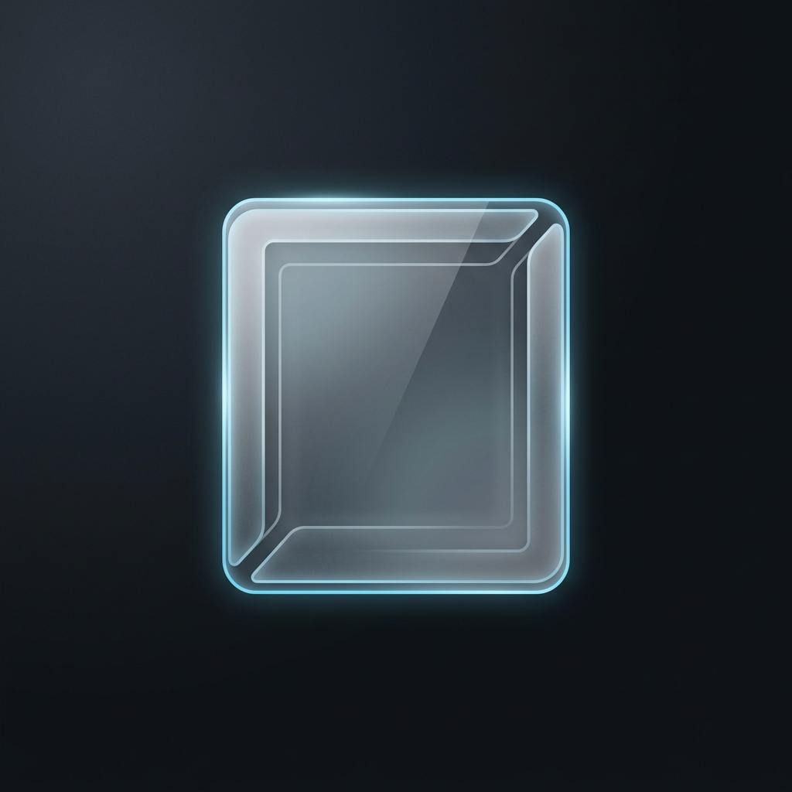

  

<h1 align="center">GlassFrame 2.0</h1>

Uma moldura de fotos discreta para Rainmeter, com slideshow por pasta, cinco layouts e configuração bilíngue.
A quiet Rainmeter photo frame with folder slideshow, five layouts, and bilingual settings.

## Português

### Recursos

- Slideshow de uma pasta, com ordem aleatória sem repetição ou ordem por nome.
- Troca simultânea de 1–4 imagens conforme o layout.
- Modo manual compatível com quatro imagens fixas.
- Cinco layouts: foto única, duas colunas, três colunas, grade 2×2 e retrato circular.
- Controles rápidos para anterior, pausa, próxima, layout e configurações.
- Escala de `0.4×` a `3.0×` usando a roda do mouse quando os controles estão ocultos.
- Persistência de pasta, intervalo, layout, escala, idioma e aparência.
- Interface em português e inglês, detectada inicialmente pelo idioma do Windows.

### Instalação e uso

1. Copie esta pasta para `Documents\Rainmeter\Skins\GlassFrame`.
2. Atualize as skins no gerenciador do Rainmeter e carregue `GlassFrame.ini`.
3. Passe o mouse sobre a moldura e abra **Configurações**.
4. Escolha uma pasta ou ative o modo de quatro imagens manuais.
5. Clique em **Aplicar**. Fechar ou cancelar não grava o rascunho.

Formatos aceitos: PNG, JPG/JPEG, BMP, GIF e WebP, respeitando o suporte da versão instalada do Rainmeter.

Se a pasta for movida, ficar inacessível ou não contiver imagens compatíveis, a moldura mostrará um estado vazio. Abra as configurações e atualize o catálogo depois de adicionar ou remover arquivos.

## English

### Features

- Folder slideshow with random-without-repeats or filename order.
- Simultaneous sets of 1–4 images according to the selected layout.
- Backward-compatible manual mode with four fixed image paths.
- Five layouts: single, two columns, three columns, 2×2 grid, and circular portrait.
- Quick controls for previous, pause, next, layout, and settings.
- `0.4×`–`3.0×` mouse-wheel scaling while controls are hidden.
- Persistent folder, interval, layout, scale, language, and appearance.
- Portuguese and English settings, initially selected from the Windows UI language.

### Install and use

1. Copy this folder to `Documents\Rainmeter\Skins\GlassFrame`.
2. Refresh skins in Rainmeter Manager and load `GlassFrame.ini`.
3. Hover over the frame and open **Settings**.
4. Choose a folder or enable the four-image manual mode.
5. Select **Apply**. Closing or cancelling does not save the draft.

Supported formats: PNG, JPG/JPEG, BMP, GIF, and WebP, subject to the installed Rainmeter version.

If the folder is moved, inaccessible, or contains no compatible files, the frame displays an empty state. Open settings and refresh the catalog after adding or removing files.

## Arquitetura / Architecture

- `GlassFrame.ini`: meters and interaction declarations.
- `Layout.lua`: layouts, slideshow queue, history, persistence, and UI state.
- `Settings.ps1`: transactional Windows settings interface.
- `IndexImages.ps1`: UTF-8 image catalog generator.
- `Variables.inc`: persistent user preferences.

## Requisitos / Requirements

- Windows 10 or Windows 11
- Rainmeter 4.5 or newer
- Windows PowerShell 5.1 or newer

## License

[MIT](./LICENSE)
